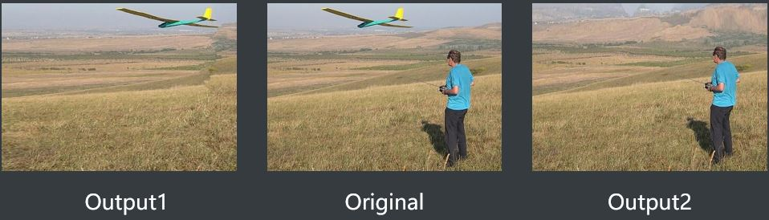
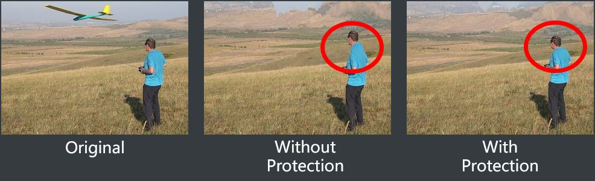
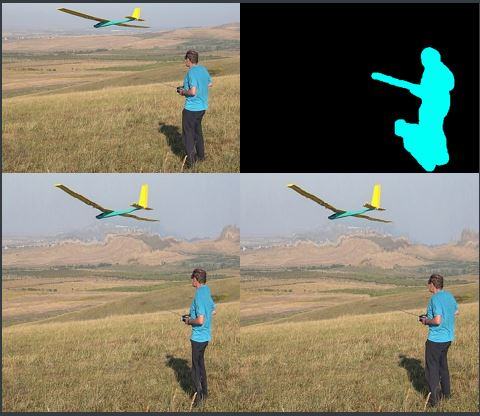
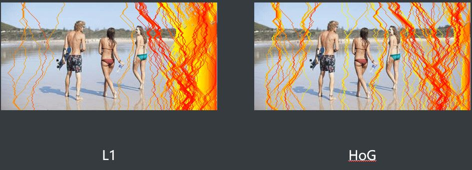
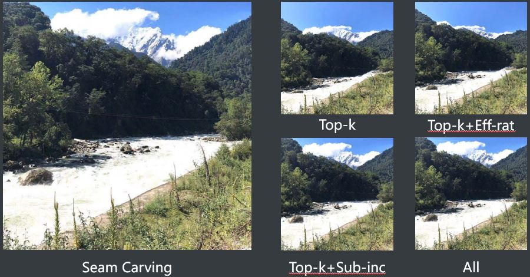

# Seamcarving

Python version Seamcarving implementation, with extra novel ideas.

Besides the basic functions proposed in paper [Seam Carving for Content-Aware Image Resizing](https://perso.crans.org/frenoy/matlab2012/seamcarving.pdf), we proposed some optimization and expanded applications.

### Novelty

- We propose a protection mode which can protect the parts we want to maintain in resizing right against object removal.
- We design an acceleration mode to reduce time consumption. We employ dynamic programming with multiple restrictions to adaptively pinpoint multiple seams after single cumulative map calculation, which dramatically improves efficiency and maintains good performance.
- We expand its application by incorporating the tools [labelme](https://github.com/wkentaro/labelme) to perform interactive object removal and protection.

### Running

```
main.py [-h]
optinal arguments:
[--new_height] target height after resizing
[--new_width] totoal target width after resizing
[--filename_input] input image filename
[--object_mask] mask of object to remove
[--protect_mask] mask of object to protect
[--demo] whether to use labelme do interactive demo
[--mode] resize, expand, remove, protect, remove and protect
[--fast_mode] whether to use accelerated version
```

```
python3 main.py
```

### Performance

For more detailed information, please refier to seamcarvimg.pdf

#### Image shrink


#### Object removal



#### Effect of Protection mode





#### Picking order of different energy function



#### Acceleration version

| **Accelerate** | **Sub Inc** | **Eff Ratio** | **Runtime/s** | **Ratio** |
| :------------: | :---------: | :-----------: | :-----------: | :-------: |
|       F        |      /      |       /       |     1719      |     /     |
|       T        |      F      |       F       |      72       |   23.88   |
|       T        |      F      |       T       |      109      |   15.77   |
|       T        |      T      |       F       |      215      |   8.00    |
|       T        |      T      |       T       |      211      |   8.15    |



